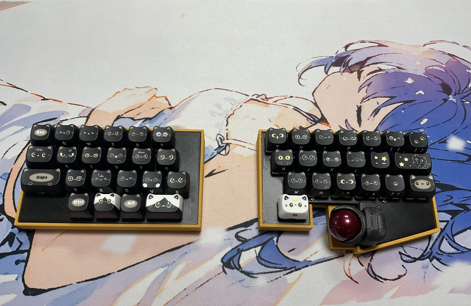

# cool942tb

## What is cool942tb?

cool942tb is splite keyboards with trackball.
 
cool942tb use [Seeed XIAO BLE nRF52840](https://jp.seeedstudio.com/Seeed-XIAO-BLE-nRF52840-p-5201.html?msclkid=5541f7f3d0f911eca6023fe520de5bfa),run [zmk_firmware](https://zmk.dev).
 
 

## Firmware

zmk-config

https://github.com/telzo2000/zmk-config-cool942tb

 

keymap editor

https://nickcoutsos.github.io/keymap-editor/

 
zmk studio

https://zmk.studio/

 

## build log

 
https://sizu.me/m_ki/posts/ib5cd4bzt3eh
 

## BOM

| No. | Patrs | Quantity | remarks | Suppliers | Cost |
|--|--|--|--|--|--|
|番号|名前|数|備考|調達先|参考価格（送料込）| 
|1|PCB|2|42key(right20key,left22key)|[elecrow](https://www.elecrow.com) [JLCPCB](https://jlcpcb.com) [ALLPCB](https://www.allpcb.com)|５枚で20〜30ドル| 
|2|XIAO nRF52840|2|MCU Board|[seeed studio](https://jp.seeedstudio.com/Seeed-XIAO-BLE-nRF52840-p-5201.html?msclkid=5541f7f3d0f911eca6023fe520de5bfa) [秋月電子](https://akizukidenshi.com/catalog/g/g117341/)|1940円|
|3|Swith socket スイッチソケット|42|cherry MX|[遊舎工房](https://yushakobo.jp) [Talp Keyboard](https://talpkeyboard.net) [Daily Craft Keyboard](https://shop.dailycraft.jp)等|10個で165円程度|
|4|Diode ダイオード|42|SMD|[遊舎工房](https://yushakobo.jp) [Talp Keyboard](https://talpkeyboard.net) [Daily Craft Keyboard](https://shop.dailycraft.jp)等|100個で220円程度から|
|5|Switch plate|2|3D Print|||
|6|Bottom case|2|3D Print|||
|7|Ball case|1|3D Print|||
|8|Knob|2|3D Print|||
|9|Screw ネジ|16|M2 4mm x 8、8mm x 8|DIY shop|10本200円程度|
|10|Spacer スペーサー|8|M2 3mm|DIY shop|10本400円程度|
|11|Conthrou コンスルー|4|3.5mm|[遊舎工房](https://yushakobo.jp) [Talp Keyboard](https://talpkeyboard.net)|１個400円程度|
|12|Keyswitch キースイッチ|42|お好みで|[遊舎工房](https://yushakobo.jp) [Talp Keyboard](https://talpkeyboard.net) [Daily Craft Keyboard](https://shop.dailycraft.jp)|１個100程度|
|13|Keycap キーキャップ|42|1U|[遊舎工房](https://yushakobo.jp) [Talp Keyboard](https://talpkeyboard.net) [Daily Craft Keyboard](https://shop.dailycraft.jp)||
|14|cable ケーブル|2|jst端子付き|[Amzon](https://www.amazon.co.jp/dp/B07NRR255D?ref=ppx_yo2ov_dt_b_fed_asin_title) |20セットで800円ほど|
|15|LiPoバッテリー|2|3.7v 303450 (600mAh)|[Amzon](https://www.amazon.co.jp/dp/B09Z6LS9CN?ref=ppx_yo2ov_dt_b_fed_asin_title)|2個セットで2000円|
|16|Trackball トラックボール|1|25mm級|[Amazon](https://www.amazon.co.jp/dp/B0D4DYH8XY?ref=ppx_yo2ov_dt_b_fed_asin_title)等|1300円ほど|
|17|pinheader ピンヘッダ|1|7pin,L字形 コンスルーでも可|[秋月電子](https://akizukidenshi.com/catalog/g/g101627/) [モノタロウ](https://www.monotaro.com/p/4372/1914/?srsltid=AfmBOooNFXhsyVNPPtl8VZ9vMxbrLr2A5btmrf5l_N4rMR9fy4N_bydG)|1個50円または10個で4500円|
Please use 14 at your own discretion.
 
14については、各自の判断の上、使用してください。
 
15については、マックエイトコンスルーだとトラックボール基板の取り外しができます。
 

In addition, you will need a USB cable, etc.
 
この他に、USBケーブル等が必要です。
 

 

## lisence

[CC BY-NC-SA](https://creativecommons.org/licenses/by-nc-sa/4.0/deed.ja)

