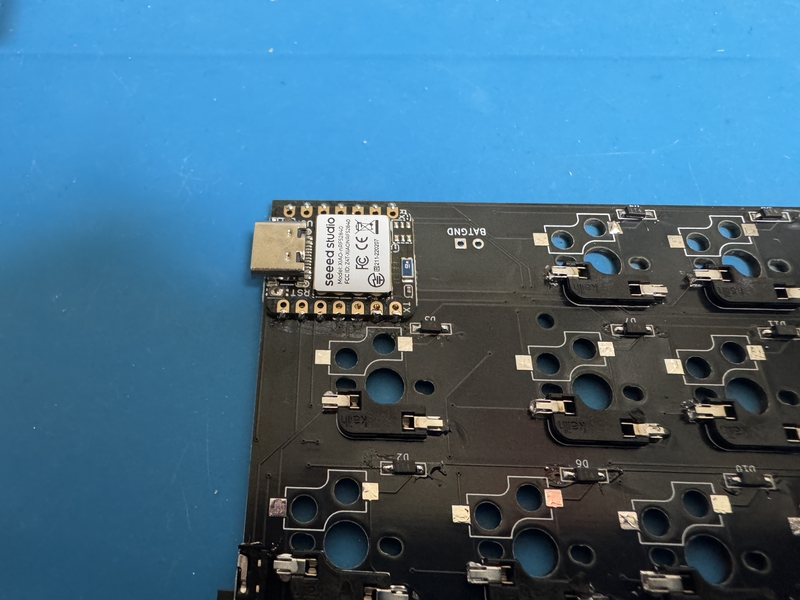

# Buildguide for cool942tb

 
This is a build guide when using Cherry MX switches and LiPo batteries.
 
Cherry MXスイッチ、LiPoバッテリーを採用した場合のビルドガイドになります。

 

## 0 部品の確認
 
Follow the BOM on github's readme.md to make sure that all the parts are available.
 
githubのreadme.mdのBOMに沿って、部品が全て揃っているかを確認してください。
 
There are three PCBs. Of the three pieces, two are left and right keyboard boards, and the remaining one is a trackball board.
 
PCBが３枚あります。表裏を確認してください。３枚のうち、2枚が左右のキーボード基板で、残り１枚がトラックボール基板です。
 

## 1ダイオードのはんだ付け

If the diode is already soldered, please skip this operation.
 
すでにダイオードのはんだ付けされている場合は、この作業を省略してください。
 
 
This work is done on the left and right keyboard boards respectively.
 
この作業は左右のキーボード基板でそれぞれ行います。
  
Solder the diodes to the back of PCB.
 
PCBの裏面にダイオードのハンダ付けをします。
 
The diode is compatible with SMD.
 
ダイオードは、SMDに対応しています。
 
Diodes have polarity, so be careful about the direction in which they are installed.
 
ダイオードには極性がありますので、取り付ける向きに注意してください。
 

[ダイオード（SMD)のはんだ付けの動画](https://youtu.be/ODk16bd4XkA)
 

 

## 2  スイッチソケットのハンダ付け

Please solder the switch socket only for cherry MX. In the future, if a switch plate and bottom case compatible with choc V2 are available, it will be able to be used as a keyboard compatible with the choc V2 switch.
 
cherry MXについてのみスイッチソケットのはんだ付けをしてください。将来的に、choc V2に対応したスイッチプレートやボトムケースができたら、choc V2スイッチ対応のキーボードとして使えるようになります。
 
 
Solder the switch socket on the back of the left and right keyboard boards.
 
左右のキーボード基板の裏面にスイッチソケットのハンダ付けをします。
 

[Switch socketハンダ付け動画](https://youtu.be/ZnbgaueMR4w?si=_JLjD--3HJJ5Pu7Q)

 

## 3 Seeed xiao bleのハンダ付け

Solder Seeed xiao ble on the back of the left and right keyboard boards. The difficulty is high, so please do it carefully.
 
左右のキーボード基板の裏面に、Seeed xiao bleをハンダ付けします。難度が高いので、注意深く行なってください。
 

Please follow the steps below.
 
次の手順に沿って行ってください。
 
1 The one with the xiao reset switch is the surface. Apply flux to the 4 BAT and NFC terminals on the back.
 
1 xiaoのリセットスイッチのある方を表面とする。裏面にある、BATとNFCの端子４つにフラックスを塗る。

 
  
2 Put the back of the keyboard board up and put xiao on it. The one with the xiao reset switch is up.
 
2 キーボード基板の裏面を上にして、xiaoを載せる。xiaoのリセットスイッチのある方を上にする。
 
 
3 Use the pin header included with xiao, insert it into the left and right pin holes, and temporarily fix it.
 
3 xiao付属のピンヘッダを利用し、左右のピン穴に差し込み、仮固定する。

 
 
4 Change the orientation of the board and xiao. The surface of the keyboard board is on top.
 
4 基板とxiaoの向きを変える。キーボード基板の表面が上になる。

 
 
5 Make sure that there are two rectangular open places on the board where xiao overlaps. Apply flux to the terminal of that part.
 
5 基板には、xiaoが重なっているところに、四角形に開いた箇所が2箇所あることを確認する。その部分の端子にフラックスを塗る。
 
 
6 Apply the warmed solder to 5 places (there are 4 places, one at a time). At the time when it is warm enough to produce a little smoke, attach the solder wire to the solder and pour in the solder.
 
From the open part of the square, if the solder is placed on the terminal of the xiao and sticks to the terminal of the board, it is fine.
  
If you put in too much solder, use the solder suction to remove excess solder.
 
6 温めたハンダゴテを５の場所（4箇所あるので、１つずつ）に当てる。少し煙が出るほど温めたタイミングで、ハンダ線をハンダゴテに付けて、ハンダを流し込む。

 
　四角形の開いた部分から、xiaoの端子にハンダが載っていて、基板の端子とくっついていれば、大丈夫である。
 
　ハンダを多く入れ過ぎた時は、ハンダ吸い取り を使い、余分なハンダを除去する。
 
 
7 With the back of the keyboard board up, pull out the temporarily fixed pin header from the board and xiao.
 
7 キーボード基板の裏面を上にして、仮固定のピンヘッダを基板とxiaoから抜く。

 
 
8 Apply flux to the left and right outer terminals of xiao. After that, solder each terminal.
 
8 xiaoの左右外側にある端子にフラックスを塗る。その後、端子ごとに、ハンダ付けをする。

 
 
Did you do well?
 
上手くできましたか？
 
 

## 4  JSTケーブルの取り付け

Please turn the back of the keyboard board up.
 
キーボード基板の裏面を上向きにしてください。
 
Plug the red cable of the JST cable into the BAT and the black cable into the GND and solder.
 
JSTケーブルの赤色ケーブルをBATに、黒色ケーブルをGNDに差し込んで、ハンダ付けをしてください。
 
 
There is something I want you to pay attention to. Make sure that the positive pole of the cable socket of the LiPo battery you want to buy is connected to the BAT and the negative pole to the GND.
 
There was a case where the red and black sides of the socket attached to the battery sold were reversed.
 
注意してほしいことがあります。購入するLiPoバッテリーのケーブルのソケットのプラス極がBATに、マイナス極がGNDに導通することを確認してください。

 
販売されているバッテリーについているソケットの赤色、黒色が左右逆の事例がありました。
 
 

## 5 スライドスイッチのハンダ付け

Insert the switch from the back of the PCB with the switch knob facing outward.
 
スイッチのつまみが外側に向くようにして、PCBの裏面から差し込みます。

After temporarily fixing it with masking tape, etc., solder the exposed part of the PCB.
 
マスキングテープなどで仮固定をしてから、PCBの表面に出た部分をはんだ付けします。
 

[スライドスイッチのはんだ付けの作業動画](https://youtu.be/5nkRklibay4)

 

## 6 L字コンスルー（またはピンヘッダ） のハンダ付け

First, use a nipper or cutter to cut the L-shaped conslue into 7 pins.
 
If you suddenly try to cut between the 7th and 8th pins, it is easy to fail, so it is a good idea to cut between the 8th and 9th pins and then adjust them with a file.
 
最初にL字コンスルーを7ピンになるようにニッパーやカッターなどを使い、裁断してください。
 
いきなり、７つ目のピンと８つ目のピンの間を裁断しようとすると、失敗しやすいので、8つ目と９つ目の間を裁断してからヤスリなどで調整するとよいでしょう。
 
 
Insert the L-shaped through spring from the surface of the keyboard board and temporarily fix it with masking tape, etc.
 
Turn the back of the board up and solder it.
 
L字コンスルーのバネのついていない方を、キーボード基板表面から差し込んで、マスキングテープなどで仮固定します。
 
基板裏面を上向にして、ハンダ付けをします。
 
 

## 7 トラックボール基板の作成

The trackball board has components installed from the beginning. The implemented side is the back side.
 
トラックボール基板は最初から部品が実装されています。実装されている面を裏面とします。
 
 
Remove the PWM3610 acrylic parts.
 
PWM3610アクリル部品を取り外します。
 
 
Check the pin of the PWM3610 and insert it from the surface of the trackball board. Temporarily fix it with masking tape.
 
PWM3610のピンを確認して、トラックボール基板の表面から差し込みます。マスキングテープで仮固定します。
 
 
The back of the trackball board is facing up and the part that came out of the pin hole is soldered.
 
トラックボール基板の裏面を上向きにして、ピン穴からでた部分をはんだ付けします。
 
 
The lens part of the PWM3610 is covered with tape, so remove it.
 
PWM3610のレンズ部分がテープで覆われているので、それを外します。
 
 
From the back of the trackball board, cover the acrylic part on the PWM3610, and melt the acrylic on the back with a soldering ick to prevent it from coming off.
 
トラックボール基板の裏面の方から、アクリル部品をPWM3610に被せて、その裏側に出たアクリルをハンダごてで溶かして外れないようにします。
 
 

## 8 スイッチプレートの組み立て

Insert the M2 8mm screw from the top of the switch plate.
 
Fix it with an M2 3mm spacer on the bottom of the switch plate.
 
スイッチプレート上面からM2 8mmネジを差し込みます。
 
それをスイッチプレート下面でM2 3mmスペーサーで固定します。
 
 
Overlay the switch plate on the PCB.
 
There are some M2 8mm screws on the underside of the PCB, so fix them with an M2 3mm spacer.
 
There are 4 places each on the left and right, a total of 8 places.
 
スイッチプレートをPCBに重ねます。
 
PCB下面にM2 8mmネジが少し出ますので、M2 3mmスペーサーで固定します。
 
左右それぞれ4箇所で、合計8箇所行います。
 

## 9 スイッチの差し込み

Plug your favorite key switch into the one you made in section 8.
 
When plugging in, it may not be plugged in properly and the terminal of the key switch may bend.
 
Please be careful.
 
If it is bent, it can be repaired with radio pliers, etc., and it can be reused.
 
It's a mistake you often make, so don't worry about it, plug in the key switch more and more.

 
セクション8で作ったものに、自分のお気に入りのキースイッチを差し込みます。
 
差し込むときに、うまく差し込めず、キースイッチの端子が曲がってしまうことがあります。
 
気を付けてください。
 
もし曲がったときは、ラジオペンチなどで直しせば、再利用できます。
 
自分もよくやるミスなので、気にせず、どんどんキースイッチを差し込みましょう。
 
 

## 10 バッテリーの固定と接続

<b>
Use a LiPo battery. Please respond to various problems arising from use at your own risk.
 
If you do not agree, please give up using the LiPo battery in cool942tb.
 
LiPoバッテリーを使用します。使用上、発生した諸問題については、ご自身の責任のもとで対応ください。
 
同意できない方は、cool942tbにおいて、LiPoバッテリーの使用を諦めてください。
</b>  
 
 
First, please check the plus and minus poles of the prepared LiPo battery.
 
Do not connect to the keyboard's JST cable immediately.
 
The JST cable extending from the keyboard is the positive pole (BAT) in red and the negative pole (GND) in black.
 
Make sure that the JST cable socket and the cable destination socket attached to the LiPo battery are connected in the same color.
 
If the same color is connected to each other, it can be used without any problems.
 
If they are not the same color, prepare a warm solder, melt the solder that fixes the substrate and the JST cable, and remove the cable.
 
Then, solder the black cable to the BAT of the substrate and the red cable to the GND. Now you can use it without any problems even if the socket is different.
 
最初に、用意したLiPoバッテリーのプラス極・マイナス極を確認してください。
 
すぐに、キーボードのJSTケーブルに繋がないでください。
 
キーボードから伸びているJSTケーブルは、赤色がプラス極（BAT）、黒色がマイナス極（GND）となっています。
 
JSTケーブルのソケットと、LiPoバッテリーについているケーブル先のソケットは、同じ色同士がつながるかどうか確認してください。
 
同じ色同士が繋がるならば、問題なく使えます。

注　同一メーカーでもソケットの赤色、黒色の差し込みが違うことがあります。
 
同じ色同士ではないならば、温めたハンダゴテを用意して、基板とJSTケーブルを固定しているハンダを溶かして、ケーブルを取り外してください。
 
そして、基板のBATに黒色のケーブルを、GNDに赤色のケーブルをはんだ付けしてください。これで、ソケットが違っていても問題なく使用できます。
 
 
If there is no problem, please connect the JST cable extending from the board to the LiPo battery cable.
 
問題がないのであれば、基板から伸びているJSTケーブルとLiPoバッテリーのケーブルを繋いでください。
 
     
        

## 11 ボトムケースの取り付け

Place the LiPo battery in the recess in the center of the bottom case. Use double-sided tape or masking tape to fix it.
 
LiPoバッテリーをボトムケースの中央にある凹部に置きます。固定には両面テープやマスキングテープを使用してください。
 
Place the switch knob in the bottom case.
 
Insert the board into the bottom case, paying attention that the convex part of the slide sitch of the board enters the concave part of the switch knob.
 
From the bottom of the bottom case, insert and fix the M2 4mm screws in 4 places on the left and right.
 
ボトムケース内に、スイッチノブを置きます。
 
スイッチノブの凹部に、基板のスライドスッチの凸部が入るように注意しながら、ボトムケース内に、基板を入れます。
 
ボトムケース底面から、左右それぞれ4箇所に、M2 4mmネジを差し込み固定します。
 

## 12 トラックボールの固定

Install the trackball board to fit the 7 pins of the L-shaped through on the right side of the keyboard board.
 
Insert 2 M2 4mm screws from the inside of the ball case and fix it with an M2 3mm spacer on the bottom of the ball case.
 
Insert the ball case so that it can be put on the trackball board.
 
The spacer on the bottom of the ball case is inserted into the concave part of the bottom case.
 
Insert 2 M2 4mm screws from the bottom of the bottom case and fix the spacer.
 
トラックボール基板をキーボード基板の右手側にあるL字コンスルーの7ピンに合うように取り付けます。
 
ボールケースの内側から2箇所、M2 4mmネジを差し込み、ボールケース底面でM2 3mmスペーサーで固定します。
 
ボールケースをトラックボール基板に被せるように差し込みます。
＜br＞
ボールケース底面にあるスペーサーがボトムケースの凹部に差し込まれるようにします。
 
ボトムケース底面から2箇所、M2 4mmネジを差し込み、スペーサーを固定します。
  
 
If you want to turn the ball better, put the support ball in 3 places in the ball case. Woodworking bonds are the best for fixing.
 
よりよくボールを回したいと考えているならば、支持球をボールケース内に3箇所入れてください。固定には、木工用ボンドが最適です。
 
 
Please attach a 25mm ball to the ball case.
 
ボールケースに25mm球を装着してください。
 
 

## 13 キーキャップの装着

Please attach your favorite keycap (40% kit is recommended).
 
お好きなキーキャップ（40％キットがお勧め）を装着してください。
 

## 14 完成

After attaching non-slip rubber to the bottom of the bottom case, it's done.
 
Please enjoy a life with a better keyboard.
 
ボトムケースの底面に、滑り止めゴムを取り付けたら、完成です。
 
よりよいキーボードのある生活を楽しんでください。
 

## 15 動作確認について

ファームウェアの導入について、こちらの記事を参考にしてください。
 
[自作キーボードへのzmk_firmwareのインストールについて](https://sizu.me/m_ki/posts/kvixkn2mec6a)

 
Keymapの編集について、こちらの記事を参考にしてください。
 

[zmk_firmwareでのキーマップ編集について](https://sizu.me/m_ki/posts/m3devs7be5km)

